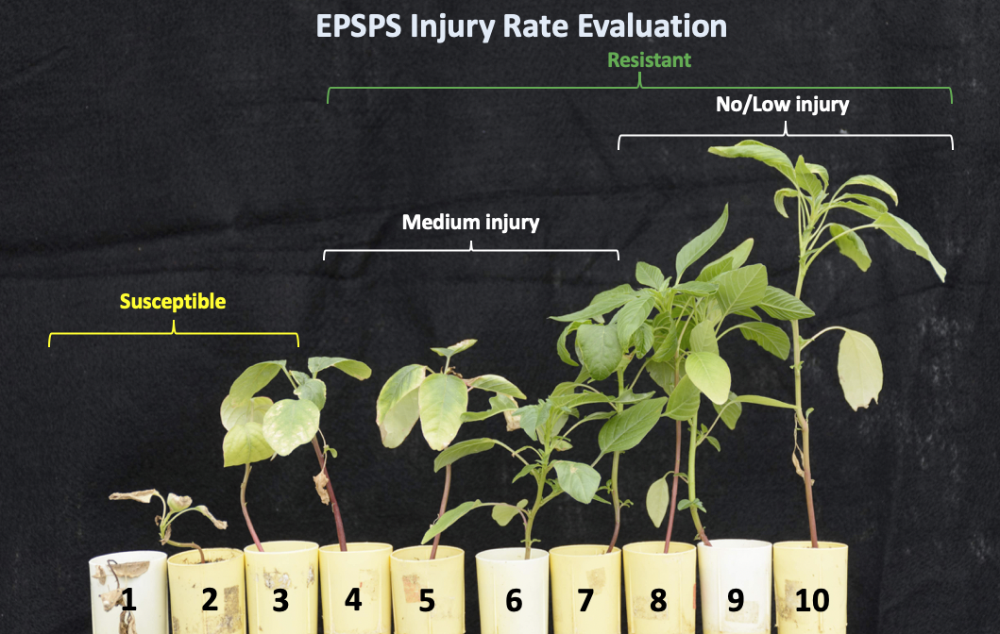

---
title: "Molecular and greenhouse validation of field evolved resistance to glyphosate and PPO-inhibitors in Palmer amaranth populations"
author: "Maxwel C Oliveira and Rodrigo Werle"
date: "10/29/2018"
output: 
    pdf_document:
    fig_caption: true
    number_sections: true
  fontsize: 11pt
 ---

\newpage 
\tableofcontents 


```{r load packages, include=FALSE}
library(ggplot2)
library(tidyverse)
library(reshape2)
library(ggrepel)
```


# Preliminary work
Leaf tissue samples from 51 Palmer amaranth populations (5 plants population^-1^) were collected at multiple counties in SW Nebraska in the fall of 2017. The samples were stored at -80C until used for a molecular screening at the University of Illinois-Urbana Champaign. Genomic DNA was extracted from five samples per population and samples were tested for the presence of the PPO glycine 210 deletion (G210), which is known to confer resistance to PPO herbicides in Palmer amaranth. Samples were also tested for genomic copy numbers of the EPSPS gene (an increase in genomic copy number of EPSPS is known to confer glyphosate resistance in Palmer amaranth). According to the molecular results of 51 Palmer amaranth populations, 59% of the populations had at least one sample positive for resistance to PPO-inhibiting herbicides. Forty-seven percent of Palmer amaranth populations tested positive for resistance to glyphosate. Moreover, 27% of the populations tested positive for resistance to both herbicide groups (Figure 1 and Table 1).


```{r, echo=FALSE, fig.cap="Distribution of EPSPS- and PPO-inhibiting herbicide resistance in Palmer amaranth populations from SW Nebraska according to molecular assays.", out.width = '80%', fig.align="center", fig.retina = 2, fig.pos='h'}
knitr::include_graphics("map.png")
```


\newpage


Herein, the percentage of Palmer amaranth populations with PPO and/or EPSPS resistance was reported as:

Equation 1: $$Y=\frac{R}{T} * 100 $$


where *Y* is the % of PPO or EPSPS resistant Palmer amararanth population in the molecular study; *R* is the number of plants with a PPO mutation or showing more than 2 EPSPS copy number; and *T* is the total number of samples for each population used in the molecular study (5).


Table: Results of the molecular screening for PPO and EPSPS resistance in Palmer amaranth populations from Nebraska.
------------------------------------------------
Population^1^ | PPO mutation | EPSPS gene copy #
------------- | ------------- | ------------- 
CHA1 | None | 1 | 
CHA2 | None | 1
**CHA3** | None | 12
CHA4 | R128G het | 23
CHA5 | PPX2_G210 | 1
DUN1 | PPX2_G210 | 8
DUN2 | PPX2_G210 | 1
**DUN3** | PPX2_G210 | 1
**DUN4** | None | 6
**DUN5** | PPX2_G210 | 24
FRO1 | PPX2_G210 | 6
FRO2 | PPX2_G210 | 6
FRO3 | PPX2_G210 |11
FRO4 | PPX2_G210 | 1
FRO5 | None | 1
**HAY1** | PPX2_G210 | 1
HAY2 | PPX2_G210 | 3
**HAY3** | PPX2_G210 | 1
**HAY4** | PPX2_G210 | 1
HAY5 | None | 1
HIT1 | None | 20
HIT2 | None | 30
HIT3 | PPX2_G210 | 6
HIT4 | None | 3
HIT5 | PPX2_G210 | 1
KEI1 | PPX2_G210 | 38
**KEI2** | PPX2_G210 | 12
**KEI3** | None| 1
KEI4 | None | 14
**KEI5** | PPX2_G210 | 7
**KEI6** | None | 21
LIN1 | PPX2_G210 | 1
LIN2 | PPX2_G210 | 5
LIN3 | PPX2_G210 | 5
LIN4 | PPX2_G210 | 4
LIN5 | None | 1
**LOG1** | PPX2_G210 | 50
**LOG2** | None | 1
LOG3|PPX2_G210 | 6
**LOG4** | PPX2_G210 | 5
PER1 | PPX2_G210 | 1
**PER2** | None | 39
PER3 | None | 1
**PER4** | None | 14
PER5 | PPX2_G210 | 1
PER6 | PPX2_G210 | 1
RED1 | PPX2_G210 | 1
**RED2** | PPX2_G210 | 3
RED3 | R128G het | 6
**RED4** | PPX2_G210 | 5
**RED5** | None | 1
^1^ Populations in bold were also screened for resistance in the greenhouse.

\newpage


# Greenhouse validation

The objective of this study was to validade the molecular results of PPO and EPSPS resistance in Palmer amaranth populations with PPO-(fomesafen and lactofen) and EPSPS-(glyphosate) inhibiting herbicide treatments. Nineteen out 51 Palmer amaranth populations were sected for the greenhouse study (Table 1). Palmer amaranth were germinated in trays containing potting mix and seedlings were tansplanted to cone-tainers at 0.5 cm tall (1--2 leaf stage). The experimental unit was a single cone-tainer with a Palmer amaranth seedling. When plants reached 8-10 cm tall, the herbicide treatment was perfomerd at 1x the recommended rate (Table 2). Each experimental run consisted of 20 plants of each Palmer amaranth population per herbicide. We conducted exprimental runs in the winter, summer, and fall (Table 3).

Table: Herbicide and rate used in the greenhouse study at the University of Wisconsin-Madison.

------------------------------------------------
Herbicide | Trade Name | Rate (g ae(ai) ha^-1^) 
------------- | ------------- | ------------- 
Glyphosate | Roundup WeatherMax | 870 
Fomesafen | Flexstar | 225.6 
Lactofen | Cobra | 12 


Table: Experimental runs of the greenhouse screening with glyphosate, fomesafen, and lactofen at the University of Wisconsin-Madison.

--------------------------------------
Run | Months | Herbicide  | 
------------- | ------------- | ------------- 
Spring | March to April | glyphosate and fomesafen
Summer | June to July  | glyphosate and fomesafen
Fall | August to September | fomesafen and lactofen


Twenty-one days after herbicide treatment, Palmer amaranth plants were rated based on a scale from 1 to 10 as descrebed in Figure 2 (PPO inhibiting herbicides) and Figure 3 (EPSPS-inhibiting herbicides). A plant rated 1 to 3, 4 to 7, or 8 to 10, was considered susceptible, medium, or with low injury, respectively. Palmer amaranth seedlings classified with medium and low injury were reported as resistant to herbicide field rate ("practical resistance"); therefore, the percentage of resistant seedlings of each population was calculated:

Equation 2: $$Z=\frac{R}{T} * 100 $$

where *Z* is the % of PPO or EPSPS resistance in plants within Palmer amaranth population in the greenhouse; *R* is the sum of Palmer amaranth seedlings showing medium (4 to 7) to low (8 to 10) injury; and *T* is the total number of Palmer amaranth plants treated with herbicide for each population (20 plants).


```{r, echo=FALSE, fig.cap="PPO-inhibiting herbicides (Fomesafen and Lactofen) injury rate evaluation at 21 days after treatment.", out.width = '50%', fig.align="center", fig.retina = 2, fig.pos='h'}
knitr::include_graphics("PPO.png")
```


```{r, echo=FALSE, fig.cap="EPSPS-inhibiting herbicides (glyphosate) injury rate evaluation at 21 days after treatment.", out.width = '50%', fig.align="center", fig.retina = 2, fig.pos='h'}

```

\newpage

# Statistical analysis

The *Y* and *Z* results for the 19 Palmer amaranth populations were regressed (*geom_smooth*) using *ggplot2* package in R statistical software. Also, the Pearson-correlation was performed to test the hypothesis that results from the molecular work match the greenhouse assay.


\newpage
# RESULTS

## Glyphosate-resistance 

Results showed correlation of 0.43 and 0.86 in the winter and summer, respectively (figure 4). Conducting the greenhouse assay during winter time might be masking the correlation results. When plants were screened during the summer, a stong correlation (P=0.00) between the results from the greenhouse and moelcular assays was detected. 


```{r load full data, echo=FALSE, include=FALSE}
Data=read_csv("Survival.csv")
glimpse(Data)
Data$Time=factor(Data$Time, levels=c("Winter", "Summer", "Fall"), labels=c("Winter 2018", "Summer 2018", "Fall 2018"))
DataRG=filter(Data, Herbicide=="Glyphosate" & Level=="Resistant")
DataRGS=filter(DataRG, Time=="Winter 2018")
cor.test(DataRGS$Perc, DataRGS$PercMolec, method = "pearson", conf.level = 0.95)
DataRGSu=filter(DataRG, Time=="Summer 2018")
cor.test(DataRGSu$Perc, DataRGSu$PercMolec, method = "pearson", conf.level = 0.95)
```


```{r, fig.cap="Regression between the fomesafen molecular and greenhouse studies. Result is presented for run in winter (left) and summer (right) timings.", echo=FALSE, fig.width = 8, fig.height= 16, fig.pos='h'}
ggplot(DataRG, aes(x=Perc, y=PercMolec, label=Population)) + geom_point(aes(size=AvegGA, color=PPO)) + geom_smooth(method='lm',formula=y~x, se=F, color="blue", size=2) +
  facet_grid(~Herbicide) + labs(x="% of alive Palmer amaranth plants in the greenhouse assay", y="% resistant Palmer amaranth plants according to the molecular assay") + 
  theme(axis.text=element_text(size=16, color="black"), 
        axis.title=element_text(size=18,face="bold"), legend.background = element_rect(linetype = "solid", color="black"), panel.border = element_rect(colour = "black", fill=NA),
        panel.background = element_rect(fill="white", color = "black"), legend.position=c("bottom"), legend.title = element_text(face="bold", size=20), legend.key = element_blank(), legend.box = "vertical", legend.text = element_text(size=14),
        panel.grid.major = element_line(color = "white"), plot.title = element_text(lineheight=.8, face="bold", hjust = 0.5),
  panel.grid.minor = element_blank(), strip.background = element_rect(fill="grey95", color="white"), strip.text.y = element_text(size = 25, color="white"), strip.text.x = element_text(size = 17, color="black", face="bold")) + 
  geom_label_repel(aes(label = Population),
                box.padding   = 0.35, 
                  point.padding = 0.5,
                  segment.color = 'grey50', size=4) + annotate("text", x = 26, y = 100, label = c("Pearson's correlation = 0.43 (P=0.06)", "Pearson's correlation = 0.86 (P=0.00)"), size=6) +
  scale_colour_manual(name="PPO resistance:", values = c("darkgreen", "red")) + facet_wrap(~Time, ncol=1) +
   scale_size_continuous(name="EPSPS copy number:", range=c(1,5), limits=c(1,50), breaks=c(1,10,20,30,40), labels=c("<2","3 to 10","11 to 20","21 to 30",">30")) + 
    ggsave("GlyphosateR.png", units="in", width=8, height=16, dpi=600) 
```


## PPO-resistance

### Fomesafen screening

Results from the PPO screening with fomesafen in Palmer amaranth showed no to low correlation between the greenhouse and molecular assays (Figure 5). The highest correlation (0.40; P=0.09) was in the experimental run conducted in the fall.


```{r, echo=FALSE, include= FALSE}
DataRF=filter(Data, Herbicide=="Fomesafen" & Level=="Resistant")
DataRF$Time=factor(DataRF$Time, levels=c("Winter", "Summer", "Fall"), labels=c("Winter 2018", "Summer 2018", "Fall 2018"))

FomesafenRS=subset(DataRF, Time=="Winter 2018")
cor.test(FomesafenRS$Perc, FomesafenRS$PercMolec, method = "pearson", conf.level = 0.95)

FomesafenRSu=subset(DataRF, Time=="Summer 2018")
cor.test(FomesafenRSu$Perc, FomesafenRSu$PercMolec, method = "pearson", conf.level = 0.95)

FomesafenRF=subset(DataRF, Time=="Fall 2018")
cor.test(FomesafenRF$Perc, FomesafenRF$PercMolec, method = "pearson", conf.level = 0.95)
```


```{r, echo=FALSE, fig.cap="Regression between the result from the fomesafen molecular and greenhouse study. Result is presented for run in winter (left), summer (center), and fall (right) timings.", echo=FALSE, fig.width = 8, fig.height= 24, fig.pos='h'}
ggplot(DataRF, aes(x=Perc, y=PercMolec, label=Population)) + geom_point(aes(size=AvegGA, color=PPO)) + geom_smooth(method='lm',formula=y~x, se=F, color="blue", size=2) + facet_wrap(~Time, ncol=1) +   labs(x="% of alive Palmer amaranth plants in the greenhouse assay", y="% resistant Palmer amaranth plants according to the molecular assay") + 
  theme(axis.text=element_text(size=16, color="black"), 
        axis.title=element_text(size=18,face="bold"), legend.background = element_rect(linetype = "solid", color="black"), panel.border = element_rect(colour = "black", fill=NA),
        panel.background = element_rect(fill="white", color = "black"), legend.position=c("bottom"), legend.title = element_text(face="bold", size=16), legend.key = element_blank(), legend.box = "vertical", legend.text = element_text(size=14),
        panel.grid.major = element_line(color = "white"), plot.title = element_text(lineheight=.8, face="bold", hjust = 0.5),
  panel.grid.minor = element_blank(), strip.background = element_rect(fill="grey95", color="white"), strip.text.y = element_text(size = 16, color="white"), strip.text.x = element_text(size = 17, color="black", face="bold")) + 
  geom_label_repel(aes(label = Population),
                box.padding   = 0.35, 
                  point.padding = 0.5,
                  segment.color = 'grey50', size=3) + annotate("text", x = 30, y = 88, label = c("Pearson's correlation = 0.14 (P=0.56)", "Pearson's correlation = 0.23 (P=0.35)", "Pearson's correlation = 0.40 (P=0.09)"), size=6) +
  scale_colour_manual(name="PPO resistance:", values = c("darkgreen", "red")) +  ylim(-10, 100) +
   scale_size_continuous(name="EPSPS gene amplification:", range=c(1,5), limits=c(1,50), breaks=c(1,10,20,30,40),labels=c("<2","3 to 10","11 to 20","21 to 30",">30")) + 
    ggsave("FomesafenR.png", units="in", width=9, height=24, dpi=600) 
```


#### Lactofen screening

There was no to low correlation between molecular and greenhouse assays with fomesafen (Figure 4). This result led us to raise the hypothesis thatfomesafen was not a good indicator to compare to the molecular results for PPO resistance. Therefore, we conducted an experimental run using lactofen, a more effective herbice (acording to field evaluation) in the diphenyl-ether family. However, for lactofen, results showed -0.38 (P=0.10) correlation between greenhouse and molecular assays with (Figure 6).

```{r, echo=FALSE, include= FALSE}
DataRL=filter(Data, Herbicide=="Lactofen" & Level=="Resistant")
cor.test(DataRL$Perc, DataRL$PercMolec, method = "pearson", conf.level = 0.95)
```


```{r, echo=FALSE, fig.cap="Regression between the fomesafen molecular and greenhouse studies. Result is presented for run in winter (left), summer (center), and fall (right) timings.", fig.width = 6, fig.height= 6, fig.pos="h"}
ggplot(DataRL, aes(x=Perc, y=PercMolec, label=Population)) + geom_point(aes(size=AvegGA, color=PPO)) + geom_smooth(method='lm',formula=y~x, se=F, color="blue") +
  labs(x="% of alive plants 21 days after herbicide application", y="% resistant plants in the molecular screening") + 
  theme(axis.text=element_text(size=11, color="black"), 
        axis.title=element_text(size=13,face="bold"), legend.background = element_rect(linetype = "solid", color="black"), 
        panel.background = element_rect(fill="white", color = "black"), legend.position=c("bottom"), legend.box = "vertical", legend.title = element_text(face="bold"), legend.key = element_blank(), legend.key.size = unit(0.3, "cm"),
        panel.grid.major = element_line(color = "white"), plot.title = element_text(lineheight=.8, face="bold", hjust = 0.5),
  panel.grid.minor = element_blank(), strip.background = element_rect(fill="grey95", color="white"), strip.text.y = element_text(size = 16, color="white"), strip.text.x = element_text(size = 16, color="black")) + 
  geom_label_repel(aes(label = Population),
                box.padding   = 0.35, 
                  point.padding = 0.5,
                  segment.color = 'grey50', size=3) + annotate("text", x = 75, y = 100, label = c("Pearson's correlation = -0.38 (P=0.10)")) +
  scale_colour_manual(name="PPO resistance:", values = c("darkgreen", "red")) + facet_grid(~Time) + xlim(0,100) +
   scale_size_continuous(name="EPSPS gene amplification:", range=c(1,5), limits=c(1,50), breaks=c(1,10,20,30,40),labels=c("<2","3 to 10","11 to 20","21 to 30",">30")) + 
    ggsave("Lactofen.tiff", units="in", width=6, height=6, dpi=300) 
```


### Fomesafen and Lactofen correlation

There was no significant correlation between fomesafen and lactofen (0.36; P=0.14) (Figure 7). 

```{r include=FALSE}
PPO_cor=read_csv("PPO_cor.csv")
cor.test(PPO_cor$PercSurvL, PPO_cor$PercSurvF, method = "pearson", conf.level = 0.95)
```


```{r, echo=FALSE, fig.cap="Regression between the fomesafen and lacotfen greenhouse studies. Result is presented for a run in fall timing.", fig.width = 6, fig.height= 6, echo=FALSE, fig.pos='h'}
ggplot(PPO_cor, aes(x=PercSurvL, y=PercSurvF, label=Population)) + geom_point(aes(size=AvegGA, color=PPO)) + geom_smooth(method='lm',formula=y~x, se=F, color="blue") +
  labs(x="% of alive plants 21 days after herbicide application", y="% resistant plants in the molecular screening") + 
  theme(axis.text=element_text(size=11, color="black"), 
        axis.title=element_text(size=13,face="bold"), legend.background = element_rect(linetype = "solid", color="black"), 
        panel.background = element_rect(fill="white", color = "black"), legend.position=c("bottom"), legend.box = "vertical", legend.title = element_text(face="bold"), legend.key = element_blank(), legend.key.size = unit(0.3, "cm"),
        panel.grid.major = element_line(color = "white"), plot.title = element_text(lineheight=.8, face="bold", hjust = 0.5),
  panel.grid.minor = element_blank(), strip.background = element_rect(fill="grey95", color="white"), strip.text.y = element_text(size = 16, color="white"), strip.text.x = element_text(size = 16, color="black")) + 
  geom_label_repel(aes(label = Population),
                box.padding   = 0.35, 
                  point.padding = 0.5,
                  segment.color = 'grey50', size=3) + annotate("text", x = 75, y = 100, label = c("Pearson's correlation = 0.36 (P=0.14)")) +
  scale_colour_manual(name="PPO resistance:", values = c("darkgreen", "red")) + facet_grid(~Time) + xlim(0,100) +
   scale_size_continuous(name="EPSPS gene amplification:", range=c(1,5), limits=c(1,50), breaks=c(1,10,20,30,40),labels=c("<2","3 to 10","11 to 20","21 to 30",">30"))
```


\newpage

# **Abstract NCWSS**

Maxwel Coura Oliveira^1^, Darci Giacomini^2^, Nikola Arsenijevic^2^, Gustavo Vieira^3^, Patrick Tranel^2^, Rodrigo Werle^1^

^1^University of Wisconsin-Madison, ^2^University of Illinois-Urbana Champaign, ^3^University of Nebraska-Lincoln

**Abstract**: Palmer amaranth (*Amaranthus palmeri*) is the most troublesome weed species in row crop production areas across the United States. It has extended emergence window and vigorous growth, which make control with POST-emergence herbicides difficult. Growers have reported that POST herbicide applications in RR soybean systems, which include glyphosate and/or PPO inhibitors, are not providing adequate levels of Palmer amaranth control. Unsatisfactory levels of Palmer amaranth control may not be exclusively due to herbicide resistance. In some cases, poor Palmer amaranth control is a result of improper herbicide application, weed size, and/or adverse environmental conditions. Therefore, the objective of this study was to validate, under greenhouse conditions, the results of molecular confirmation of PPO and EPSPS resistance in Palmer amaranth populations. Nineteen Palmer amaranth populations from western Nebraska were used in this study with 20 seedlings herbicide^-1^  run^-1^, which was conducted during winter, summer, and fall. Palmer amaranth seedlings were treated at 8-10 cm tall with EPSPS-(glyphosate) and PPO- (fomesafen and lactofen) inhibiting herbicides at the field recommended rate. At 21 days after herbicide treatment, plants were evaluated as dead (susceptible) or alive (resistant). Pearson-correlation was performed to evaluate if greenhouse screenings match the results from the molecular assay. Results showed strong correlation between greenhouse and molecular assays (EPSPS gene copy number) for glyphosate resistance. The correlation was higher (0.86; P<0.01) when Palmer amaranth plants were screened in summer versus winter (0.43; p=0.06). Greenhouse screening for fomesafen (PPO resistance) did not correlate to results from molecular assays (_G210 deletion). The highest correlation for fomesafen (PPO resistance) was in the fall run (0.40; P=0.09). Lactofen was used to investigate whether the PPO results deviate by herbicide within the PPO-inhibiting herbicides. Lactofen demonstrated similar results to fomesafen but negative correlation (-0.38; P=0.10) with the molecular study. Therefore, the use of molecular techniques for detection of glyphosate resistance in Palmer amaranth is robust and accurate, but not necessarily for PPO-inhibiting herbicides. The segregation for herbicide resistance in Palmer amaranth and environmental conditions (greenhouse assays) might play an important role in our results as correlations strongly deviate between runs, especially for PPO resistance. 


